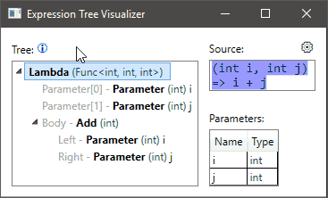
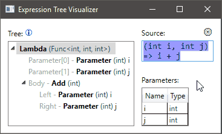

# Expression To Code and Expression Tree Visualizer
This project provides the following:

* Extension methods to create a code-like string representation in C# or VB.NET
* A debugging visualizer for expression trees

Currently, you have to compile in order to use. The visualizer DLL needs to be placed in the appropriate folder, as outlined [here](https://docs.microsoft.com/en-us/visualstudio/debugger/how-to-install-a-visualizer?view=vs-2017). Eventually there'll be a NuGet package for the extension methods library, and a VSIX package for the visualizer.

---

## Expression To Code
```csharp
Expression<Func<bool>> expr = () => true;

// output -- () => true
Console.WriteLine(expr.ToCode("C#")); 

// output -- Function() True
Console.WriteLine(expr.ToCode("Visual Basic"));
```

Features:

* Support for outputting both C# and VB.NET
* Extension methods are rendered as instance methods

    ```csharp
    Expression<Func<int, int>> expr = x => Enumerable.Range(1, x).Select(y => x * y).Count();
    Console.WriteLine(expr.ToCode("C#"));
    // output -- (int x) => Enumerable.Range(1, x).Select((int y) => x * y).Count()
    ```

* Closed-over variables are rendered as simple identifiers (instead of member access on the hidden compiler-generated class)

    ```csharp
    var i = 7;
    var j = 8;
    Expression<Func<int>> expr = () => i + j;
    Console.WriteLine(expr.ToCode("C#"));
    // output -- () => i + j
    ```

Note that support for the full range of types in `System.Linq.Expressions` is incomplete, but progressing.

---

## Expression Tree Visualizer


The UI consists of three parts:

1. Tree view of the various parts of an expression tree
2. Source code view, using the above `ExpressionToCode` library
3. End nodes -- nodes in the expression tree which are not composed of other expressions

## Visualizer features

* Live switching between C# and VB.NET

    
    
* Selection syncing when selecting from the tree:

  

  from source code:

  

  and from end nodes:

  

# Credits

* John M. Wright's series on [writing debugger visualizers](https://wrightfully.com/writing-a-readonly-debugger-visualizer)
* [WPF AutoGrid](https://github.com/carbonrobot/wpf-autogrid)
* Multiple-selection treeview is provided by [MultiSelectTreeView](https://github.com/ygoe/MultiSelectTreeView)
* [ReadableExpressions](https://github.com/agileobjects/ReadableExpressions)
* [Greenshot](https://getgreenshot.org/) and [ScreenToGIF](https://www.screentogif.com/) for the screenshots
